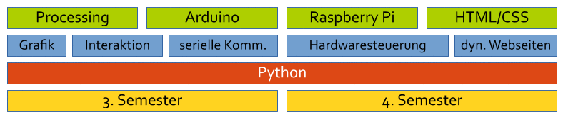

% Processing.py and Arduino
% Axel Dürkop, TUHH
% Pyunconf Sep 10, 2016

# Teaching And Learning How To Code

## The Group

- *Medientechnik* and *Elektrotechnik* students
- Their intention: becoming teachers in vocational training (Berufsschullehrer_innen)

## Format

- Two semesters *Introduction to Informatics*
- My intention: introduce them to basic programming skills



<small>Quelle: Axel Dürkop, Seminarkonzept "Einführung in die Informatik, iTBH, TUHH"</small>

# Learning Python with Processing

## Processing

- [Processing](https://processing.org/) website
- IDE for easily developing artistic programms
- Code usually being compiled to Java

------


## Processing.py

- Python is a *mode* in Processing


## (Almost) the best of two worlds

- Lots of Processing libraries can be used
- Main Python packages can be used

-----


-----


------


## Processing.py Example

```Python
def draw():
  ellipse(mouseX, mouseY, 20, 20)
```

# Arduino

## Hardware

 [CC-BY 2.0](https://creativecommons.org/licenses/by/2.0/)](./abb/arduino-uno-flickr-snootlab.jpg)

------


## Blink

```Java
byte led = 13;

void setup() {
  pinMode(led, OUTPUT);
}

void loop() {
  digitalWrite(led, HIGH);  
  delay(1000);         
  digitalWrite(led, LOW);
  delay(1000);
}
```

## Blink


## Firmata

> "Firmata is a protocol for communicating with microcontrollers from software on a host computer. (https://github.com/firmata/arduino)"

- **StandardFirmata** is a preinstalled library in the Arduino IDE

## Firmata

- Once transfered like a normal sketch to the Arduino
- Serial communication (via USB) from the host computer using Processing.py

## API

- `list()`
- `pinMode(pin, mode)`
- `digitalRead(pin)`
- `digitalWrite(pin, value)`
- `analogRead(pin)`
- `analogWrite(pin, value)`
- `servoWrite(pin, value)`

## Processing.py &raquo; Arduino

```Python
# This is Python code in Processing

add_library('serial')
add_library('arduino')

led = 13

def setup():
    a = Arduino(this, '/dev/ttyACM1', 57600)
    a.pinMode(led, Arduino.OUTPUT)
    a.digitalWrite(led, Arduino.HIGH)

def draw():
    pass
```

# Why not PyGame?

## PyGame

First line is the import of a library

```Python
import sys, pygame
pygame.init()
```

## Processing.py

First success comes with one, two line(s) of code

```Python
def draw():
  ellipse(mouseX, mouseY, 20, 20)
```

## Links

- http://www.python-processing-arduino.de/
- axel.duerkop@tuhh.de
- @xldrkp
- github.com/xldrkp
